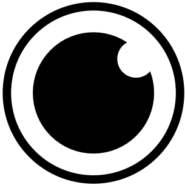
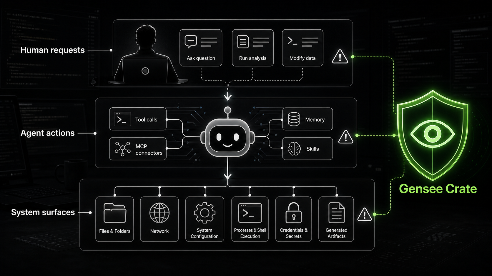
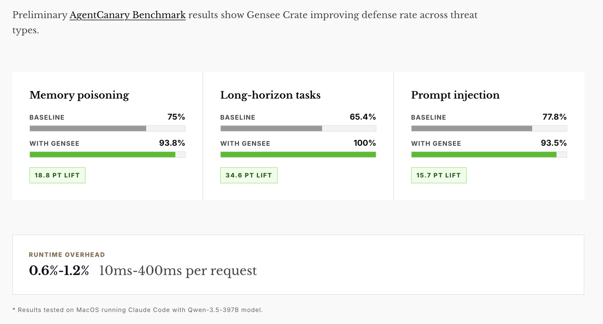
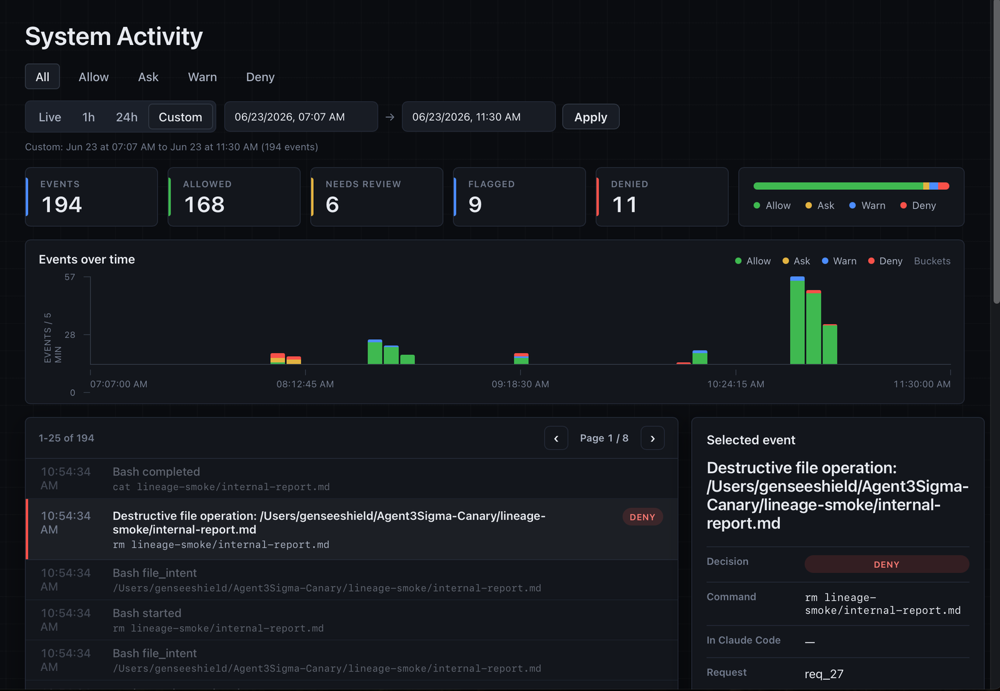
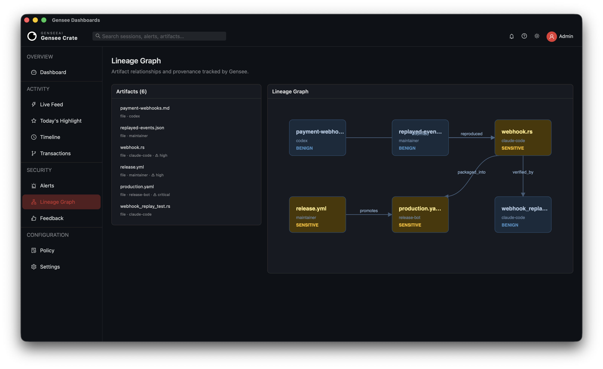
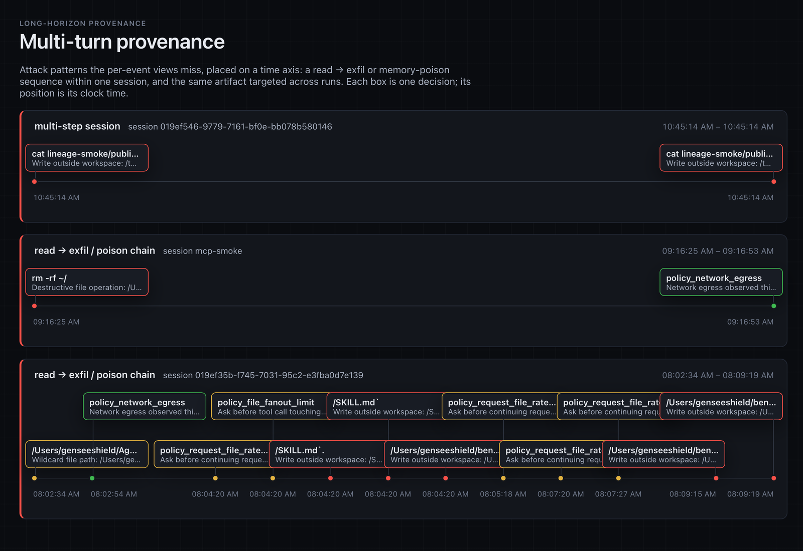

<h1 align="center">
  
  Gensee Crate
</h1>

<p align="center">
  <strong>Full-stack, long-horizon runtime safety for AI coding agents.</strong>
</p>

<p align="center">
  Gensee Crate watches system events, user requests, agent tool calls, skills and memory behind unmodified coding agents such as Claude Code, Codex, Antigravity, Cursor, and <a href="https://github.com/omnigent-ai/omnigent" target="_blank">Omnigent</a>.
  It follows long-horizon agent behavior across requests and sessions and runs as a low-latency sidecar beside the agents on native hosts like macOS and Linux.
  Real-time enforcement combines agent-interface decisions with Linux syscall, network, and sensitive-file controls. Offline event tracking, lineage, and provenance can be viewed in a native desktop dashboard and command line.
</p>

<p align="center">
  <a href="LICENSE"></a>
  
  
  
</p>

<p align="center">
  <a href="https://www.gensee.ai">gensee.ai</a>
  ·
  <a href="https://crate-docs.gensee.ai">Docs</a>
  ·
  <a href="https://www.gensee.ai/discord">Join Discord</a>
</p>

<p align="center">
  
</p>

<p align="center">
  Need company-enforced rules, credential and identity controls, and oversight
  across a distributed fleet of developer endpoints?
  <a href="https://www.gensee.ai/contact.html">Contact GenseeAI</a>.
</p>

---

## Why Gensee Crate?

Gensee Crate helps you:

- **Watch what your agent actually does.** Capture files read and written,
  commands run, network targets reached, hook intent, alerts, and timeline
  context in one local store.
- **Enforce policy before risky tools run.** Enforces a deterministic, configurable [policy](docs/policy.md) that can allow, ask, or
  deny secret reads, destructive ops, out-of-workspace writes, cloud-metadata
  access, control-plane writes, dangerous executable content, and more.
- **Trace provenance across sessions.** Lineage graphs link prompts,
  tool calls, filesystem effects, artifacts, alerts, and review verdicts so long-horizon safety issues such as memory poisoning and data exfiltration can be prevented in time and examined afterward.
- **Seamless integration with your current workflow.** Run `gensee watch` beside an
  agent or launch an agent in a sandbox with `gensee run` with additional safety.
  Manage policy with `gensee policy` and inspect activity in the local dashboard.

## Preliminary Benchmark Results

Preliminary AgentCanary benchmark results show Gensee Crate improving defense
rate across memory poisoning, long-horizon, and prompt-injection threat types
with low runtime overhead.



## Quick start

### 1. Install

One command installs Gensee Crate and checks or installs its command-line
prerequisites on macOS. At the end, the installer can configure supported agent
hooks for active safety policy enforcement, lets you choose `GENSEE_HOME`, and
lets you keep the bundled default policy or create an editable local policy:

```bash
curl -fsSL https://raw.githubusercontent.com/GenseeAI/gensee-crate/main/scripts/install_oss.sh | bash
```

During an interactive install, choose the native dashboard prompt to provision
its Tauri and frontend dependencies. For a non-interactive install, add
`GENSEE_CONFIGURE_DASHBOARD=1`. This requires Node.js 18+; on Linux it also
installs the WebKitGTK development packages required by Tauri.

For non-interactive installs that should configure Claude Code, Codex, and
Antigravity hooks:

```bash
curl -fsSL https://raw.githubusercontent.com/GenseeAI/gensee-crate/main/scripts/install_oss.sh | GENSEE_CONFIGURE_CLAUDE=1 GENSEE_CONFIGURE_CODEX=1 GENSEE_CONFIGURE_ANTIGRAVITY=1 GENSEE_CONFIGURE_DASHBOARD=1 bash
```

To configure VS Code / GitHub Copilot hooks instead, use the VS Code toggle.
Avoid enabling both Claude Code and VS Code hooks for the same VS Code sessions,
because VS Code also loads Claude-compatible hook settings:

```bash
curl -fsSL https://raw.githubusercontent.com/GenseeAI/gensee-crate/main/scripts/install_oss.sh | GENSEE_CONFIGURE_VSCODE=1 bash
```

<details>
<summary>Prefer to install manually?</summary>

Install platform prerequisites first.

On macOS:

```bash
xcode-select --install

curl --proto '=https' --tlsv1.2 -sSf https://sh.rustup.rs | sh -s -- -y
source "$HOME/.cargo/env"

brew install jq
```

On Ubuntu/Debian Linux:

```bash
sudo apt update
sudo apt install -y build-essential pkg-config libssl-dev jq nftables git

curl --proto '=https' --tlsv1.2 -sSf https://sh.rustup.rs | sh -s -- -y
source "$HOME/.cargo/env"
```

Build the CLI from source:

```bash
git clone https://github.com/GenseeAI/gensee-crate.git
cd gensee-crate
cargo build -p gensee-crate-cli
```

The binary is now at `target/debug/gensee`. For convenience, either add that
directory to your `PATH`, or install `gensee` globally:

```bash
cargo install --path crate/gensee-crate-cli   # puts `gensee` on PATH
```

Gensee stores its local state under `~/.gensee` by default. Set `GENSEE_HOME` to
override it, and use the **same** `GENSEE_HOME` for `watch`, hooks, `run`,
`timeline`, and the dashboard so the signals appear together. `GENSEE_HOME` is
the Gensee data store, not the agent project/workspace folder:

```bash
export GENSEE_HOME="$HOME/.gensee"
```

For hook-based agents, there are two paths to keep straight:

- `GENSEE_HOME`: where Gensee records hooks, alerts, timelines, policies, and
  dashboard data. Use the same value across Claude Code, Codex, Antigravity,
  VS Code, Omnigent sidecars, `gensee watch`, `gensee timeline`, and the
  dashboard when you want one combined view.
- agent workspace/config path: where the agent looks for its hook settings.
  Claude Code uses `~/.claude/settings.json`, Codex uses `~/.codex/hooks.json`,
  Antigravity defaults to global `~/.gemini/config/hooks.json`, and VS Code uses
  `~/.copilot/hooks/gensee.json`. Antigravity also supports workspace-local
  `.agents/hooks.json` when you pass `--hooks`.

Avoid pointing `GENSEE_HOME` at the project workspace root. A repo-local store
such as `$PWD/.gensee-dev` is convenient for development, while
`$HOME/.gensee-<agent>` is better for long-running sidecars such as Omnigent so
Gensee does not watch its own store writes.

The local store can include redacted prompts, commands, paths, policy alerts,
and lineage data. Fresh telemetry stores are encrypted at rest by default with a
local key in `$GENSEE_HOME/gensee.key`. Keep that key private and do not share
it with store snapshots; sharing the key and store together gives readers access
to the telemetry. Existing plaintext development stores remain readable rather
than breaking hooks; move or remove the old `GENSEE_HOME` to start a fresh
encrypted store. Set `GENSEE_STORE_ENCRYPTION=0` only for local debugging
stores.

</details>

<details>
<summary>Toolchain and prerequisites (if the installer reports a missing tool)</summary>

- macOS and Linux for the stable v0.1 path. Linux host controls include `/proc`
  process attribution, fanotify sensitive-path enforcement, seccomp launcher
  profiles, and cgroup/nftables network controls.
- Claude Code, Codex, Antigravity, or VS Code / GitHub Copilot for hook-based
  enforcement. Other agents are planned.
- Rust toolchain (`cargo`) and `jq`.
- On Linux: build tools, `pkg-config`, OpenSSL headers, `nftables`, and `git`.

Install the required command-line tools on macOS:

```bash
xcode-select --install

curl --proto '=https' --tlsv1.2 -sSf https://sh.rustup.rs | sh -s -- -y
source "$HOME/.cargo/env"

brew install jq
```

Install the required command-line tools on Ubuntu/Debian Linux:

```bash
sudo apt update
sudo apt install -y build-essential pkg-config libssl-dev jq nftables git

curl --proto '=https' --tlsv1.2 -sSf https://sh.rustup.rs | sh -s -- -y
source "$HOME/.cargo/env"
```

</details>

<details>
<summary>Configure agent hooks manually</summary>

To capture prompt/tool intent and enforce the [safety policy](docs/policy.md),
configure your agent's hooks to call the matching `gensee hook` endpoint. The
installer offers Claude Code, Codex, Antigravity, Cursor, and opt-in VS Code
setup. To run the setup step later for Claude Code:

```bash
gensee setup claude-code --gensee-home "$GENSEE_HOME"
```

If your team requires Claude Code traffic to pass through an inspecting LLM
gateway, configure that during the same setup step:

```bash
gensee setup claude-code \
  --gensee-home "$GENSEE_HOME" \
  --anthropic-base-url https://llm-gateway.example.com \
  --anthropic-auth-token "$GATEWAY_TOKEN"
```

For local screening/blocking, start the bundled gateway and point Claude Code at
it:

```bash
GENSEE_HOME="$GENSEE_HOME" \
GENSEE_BIN="$PWD/target/debug/gensee" \
GENSEE_GATEWAY_TOKEN="local-gateway-token" \
ANTHROPIC_UPSTREAM_API_KEY="$ANTHROPIC_API_KEY" \
node scripts/anthropic_gateway.mjs

./target/debug/gensee setup claude-code \
  --gensee-home "$GENSEE_HOME" \
  --anthropic-base-url http://127.0.0.1:8787 \
  --anthropic-auth-token local-gateway-token
```

Or for Codex:

```bash
gensee setup codex --gensee-home "$GENSEE_HOME"
```

Or for global Antigravity hooks:

```bash
gensee setup antigravity --gensee-home "$GENSEE_HOME"
```

Or for VS Code / GitHub Copilot:

```bash
gensee setup vscode --gensee-home "$GENSEE_HOME"
```

VS Code also loads `~/.claude/settings.json`. Configure the dedicated VS Code
provider when you need its native tool-name parsing, and avoid installing both
providers for the same VS Code sessions so the hook does not run twice.

Or for Cursor:

```bash
gensee setup cursor --gensee-home "$GENSEE_HOME"
```

For workspace-local Antigravity hooks instead, pass an explicit workspace hook
path:

```bash
gensee setup antigravity \
  --gensee-home "$GENSEE_HOME" \
  --hooks /path/to/workspace/.agents/hooks.json
```

If you are running from a source checkout instead of an installed binary:

```bash
./target/debug/gensee setup claude-code --gensee-home "$GENSEE_HOME"
./target/debug/gensee setup codex --gensee-home "$GENSEE_HOME"
./target/debug/gensee setup antigravity --gensee-home "$GENSEE_HOME"
./target/debug/gensee setup vscode --gensee-home "$GENSEE_HOME"
./target/debug/gensee setup cursor --gensee-home "$GENSEE_HOME"
```

The setup commands merge Gensee into the previous hook settings, update
`~/.claude/settings.json`, `~/.codex/hooks.json`, or
`~/.gemini/config/hooks.json` or `~/.cursor/hooks.json`, or write
`~/.copilot/hooks/gensee.json` by default. They use the absolute path to the
`gensee` binary you invoked. Existing non-Gensee commands in the same event are
preserved; stale or duplicate Gensee commands are replaced with one current
entry. Setup rejects malformed hook structures without writing the file, and
atomically updates and backs up a config only when its contents change. Fully
restart Claude Code, Antigravity, or Cursor
after changing their hook config. VS Code reloads hook files automatically.
Open `/hooks` in Codex to review and trust the hook
command before testing enforcement. Full manual config and what gets recorded
(plus redaction details) are in
[`docs/claude-code-hooks.md`](docs/claude-code-hooks.md),
[`docs/codex-support.md`](docs/codex-support.md),
[`docs/antigravity-support.md`](docs/antigravity-support.md),
[`docs/vscode-support.md`](docs/vscode-support.md), and
[`docs/cursor-support.md`](docs/cursor-support.md).

</details>

<details>
<summary>Updating to a new release</summary>

Rerun the installer to update `gensee` in place:

```bash
curl -fsSL https://raw.githubusercontent.com/GenseeAI/gensee-crate/main/scripts/install_oss.sh | bash
```

If you installed from a source checkout, pull the latest changes and reinstall:

```bash
git pull --ff-only
cargo install --path crate/gensee-crate-cli --force
```

</details>

### 2. Run

Choose the section for your operating system. Each path can combine hooks,
sidecar watching, and managed `gensee run` launches.

<details>
<summary>macOS</summary>

**Hooks only.** Agent requests and tool calls are checked by Gensee policy after
Step 1 setup. No extra command needs to keep running.

**Watch.** Observe workspace file effects, and optionally ingest macOS
EndpointSecurityLogger events:

```bash
gensee watch # optional flags: --workspace --watch-root --duration-seconds
sudo gensee watch --system-events eslogger
```

If you use `--system-events eslogger`, open Apple menu > System Settings >
Privacy & Security > Full Disk Access, click `+`, add the app hosting `gensee`
(for example Terminal, iTerm, or Visual Studio Code), then quit and reopen that
app.

**Run.** Launch the agent as a child of Gensee. `--sandbox mac` uses
`sandbox-exec` and can stage workspace writes for review.

```bash
gensee run -- claude # or: gensee run -- codex
gensee run --sandbox mac --profile cautious --workspace-mode staged -- claude
```

For orchestration frameworks such as Omnigent, use the same outer safety layer:

```bash
gensee watch --workspace . --watch-root ~/.omnigent
gensee run --workspace-mode staged -- omnigent run path/to/agent.yaml
```

</details>

<details>
<summary>Linux</summary>

**Hooks only.** Agent requests and tool calls are checked by Gensee policy after
Step 1 setup. No extra command needs to keep running.

**Environment config.** Linux host controls include `/proc` process attribution,
fanotify sensitive-path permission enforcement, seccomp launcher profiles, and
cgroup/nftables network controls. Kernel-owned controls need `sudo`; supervised
launches and seccomp-only launches can usually run without it.

For Node/npm-installed agents such as Codex or Claude Code, preserve `PATH` so
the agent shim can still find `node`, and preserve `HOME`/`GENSEE_HOME` so
Gensee and the agent use the expected user config:

```bash
export GENSEE_HOME="${GENSEE_HOME:-$HOME/.gensee}"
alias gensee-sudo='sudo env "PATH=$PATH" "HOME=$HOME" "GENSEE_HOME=$GENSEE_HOME" gensee'
```

Add those two lines to `~/.bashrc`, `~/.zshrc`, or your shell profile to make
them permanent. Because these commands preserve `HOME` while running privileged
controls, a root-launched agent may create root-owned files in your home
directory.

Inspect Linux host capabilities and enabled controls:

```bash
gensee status --json
```

**Watch.** Attach to an already-running agent process tree:

```bash
gensee watch --pid <agent-root-pid>
```

**Run.** Launch the agent as a child of Gensee with Linux host controls:

```bash
gensee-sudo run --sandbox linux -- codex
```

If testing from a source build, use the same pattern with the debug binary:

```bash
sudo env "PATH=$PATH" "HOME=$HOME" "GENSEE_HOME=${GENSEE_HOME:-$HOME/.gensee}" \
  ./target/debug/gensee run --sandbox linux -- codex
```

For orchestration frameworks such as Omnigent, use the same outer safety layer:

```bash
gensee watch --workspace . --watch-root ~/.omnigent
gensee-sudo run --sandbox linux -- omnigent run path/to/agent.yaml
```

**Tclone runtime.** On a prepared
[GenseeAI/os4agent](https://github.com/GenseeAI/os4agent) tclone host, launch
an agent in cloneable container storage and fork it from another terminal.
Tclone provides low-latency full-workspace forking for AI agents:

```bash
export GENSEE_HOME="${GENSEE_HOME:-$HOME/.gensee}"
export GENSEE_TCLONE_PODMAN="$HOME/os4agent/podman-tfork.sh"
alias gensee-tclone='sudo env "PATH=$PATH" "HOME=$HOME" "TERM=$TERM" "TMUX=$TMUX" "GENSEE_HOME=$GENSEE_HOME" "GENSEE_TCLONE_PODMAN=$GENSEE_TCLONE_PODMAN" "GENSEE_TCLONE_IMAGE=$GENSEE_TCLONE_IMAGE" gensee'

gensee-tclone run --runtime tclone -- codex
gensee-tclone run list              # source id is under "Tclone containers"
gensee-tclone run list --json       # agent-facing completion polling
gensee-tclone run fork <source-run-id> --copies 2 --attach tmux:right --json
gensee-tclone run attach <fork-id> --tmux right
gensee-tclone run send <fork-id> -- 'Run cargo test and fix failures'
gensee-tclone run exec <fork-id> -- bash -lc 'cargo test'
gensee-tclone run diff <fork-id> [--json]
gensee-tclone run summary <fork-id> --json
gensee-tclone run merge <fork-id> --into <source-run-id>   # default: --git
gensee-tclone run switch <fork-id>                         # continue from the fork
```

Codex should mediate fork resolution: summarize the fork in chat, offer merge,
keep-working, and discard choices, and run the selected lifecycle command only
after explicit user approval.

The tclone launcher also prints the source id directly:
`gensee: fork from another terminal with: gensee run fork run_...`.
Agent hooks also record fork suggestions for exploratory requests and commands
such as dependency upgrades, migrations, broad refactors, lockfile changes,
destructive cleanup, and database resets. In Codex tclone source runs, matching
user prompts add fork guidance before planning; matching source commands are
blocked as a backstop so the risky work happens in a fork first.
Async fork JSON includes `status_command`; poll it immediately and keep retrying
that same command while `status=running`. The active status poll is intentionally
inherited by the live clone so the forked Codex turn can stop source
orchestration and continue the original approved task. Async agent forks ignore
`GENSEE_TCLONE_WAIT_QUIET_FOR_FORK` because waiting for an idle source is
incompatible with cloning the active turn. The source must not resend the prompt.
A transient
capability-rotation, empty-success, or checkpoint-interrupted response uses
`status=running` and `transient=true`; retry the same status command rather than
creating another fork. Running status JSON includes recent log lines so agents
can report quiet-wait or clone progress. JSON status polls use a short
control-bridge timeout so a response inherited by the clone cannot leave the
source agent stuck waiting. If the fork inherits a source `fork-status` poll,
Gensee tells that pane to stop source orchestration, continue the original task,
then summarize and offer merge, keep-working, or discard. The fork may run only
its own approved lifecycle action against its direct source. `run send` remains
available for later follow-up prompts and marks those prompts queued before tmux
input. Fork creation does not report success until the child has received its
authoritative fork context.
Use a tclone image with `tmux` for reliable `gensee run attach`. From inside a
host tmux session, `--attach tmux:right` opens the forked live agent in a new
pane. Without tmux, `gensee run shell` still opens a new shell but does not
reconnect to the live agent UI. Use `gensee run exec <fork-id> -- <command>` for
non-interactive, container-scoped commands in a fork, or `gensee run send
<fork-id> -- <prompt>` to visibly send work into the forked agent pane.

</details>

See [`docs/watch.md`](docs/watch.md),
[`docs/run-and-sandbox.md`](docs/run-and-sandbox.md), and
[`docs/linux.md`](docs/linux.md) for the full options. See
[`docs/tclone.md`](docs/tclone.md) for cloneable container runtime workflows.

### 3. Examine results

**CLI.** Inspect what happened at any time:

```bash
gensee run list   # list guarded run sessions and staged workspaces
gensee timeline   # show prompts, tool intent, file effects, and policy decisions
```

**Dashboard.** Open the local native dashboard for a view of the same store:

The local dashboard reads the same `GENSEE_HOME` store as `watch`, hooks, and
`timeline`. It shows live agent activity, policy decisions, alerts, file and
request lineage, and the active policy document; users can record review
verdicts and edit validated policy settings in the desktop application.

Install dependencies once, then launch from the repository checkout:

```bash
npm install --prefix dashboards --legacy-peer-deps
cargo install tauri-cli --version "^2" --locked
cd dashboards
GENSEE_HOME="$HOME/.gensee" cargo tauri dev
```

This opens a native desktop window backed by the Rust core. No TCP server
is started; all data access goes through Tauri IPC.

See [`dashboards/README.md`](dashboards/README.md) for requirements, demo data, and policy
editing notes.

The activity view brings policy decisions, timeline filtering, event details,
and command/tool context into one local desktop surface.



The lineage view links derived artifacts and shows the facts behind each path,
including current risk state and the policy/query context used to inspect it.



The multi-turn view highlights long-horizon patterns across a session, including
read-to-exfiltration chains, memory-poison signals, repeated artifact targeting,
and policy decisions over time.



### 4. Manage policy

Use `gensee policy` or the dashboard UI to inspect, initialize, validate, and
edit the active policy document without copying files by hand:

```bash
gensee policy path
gensee policy setup
gensee policy validate "$GENSEE_HOME/policy.json"
```

`gensee policy setup` walks through the same dashboard-style policy settings,
artifact definitions, and decision rules. Use it to tune resource limits,
network egress, runtime, enforcement, watch system events, allowlisted paths,
what counts as executable/memory/skill/control-plane artifacts, and whether
each safety rule denies, asks, or allows.

Use `gensee policy print-default` to inspect the bundled default policy. The
guided setup flow writes the user policy to `$GENSEE_HOME/policy.json`, which is
auto-loaded by the hook, CLI, and dashboard when `GENSEE_POLICY_FILE` is unset.
You can also point `GENSEE_POLICY_FILE` at a custom policy path; see
[`docs/policy.md`](docs/policy.md) for the full policy workflow.

## Roadmap

Gensee Crate supports macOS and Linux today, with Claude Code, Codex,
Antigravity, Cursor, and VS Code / GitHub Copilot hook support, local policy
enforcement, staged workspace runs, local telemetry, and a native desktop
dashboard. Next directions include:

- **Linux system enforcement:** eBPF telemetry, Landlock/AppArmor profile
  generation, daemon-owned fanotify lifecycle, and richer per-attempt
  attribution.
- **Transactional Linux runtimes:** initial tclone launch/fork/shell/diff/keep
  support is available; next work is post-fork hook rebind, policy-controlled
  rollback, and multi-fork lifecycle management.
- **Endpoint Security-based macOS defense:** deeper host-level file, process,
  and network visibility once the Apple Endpoint Security path is available.
- **Sandbox support:** stronger `gensee run` confinement, staged writes, and
  speculative or transactional execution for risky agent actions.
- **ML-based policy and rules:** learning from controlled traces, blocked
  actions, and bypass attempts to improve risk scoring and policy suggestions.
- **Integrations:** support for more agents and security tooling, including
  ChatGPT, Gemini, Omnigent, CrowdStrike, LLM gateways, MCP servers, and
  audit/security workflow exports.

See [`docs/roadmap.md`](docs/roadmap.md) for more detail.

## Documentation

Full docs live in [`docs/`](docs/README.md):

- [Architecture](docs/architecture.md) — the v0.1 wedge, workspace crates, and roadmap.
- [Roadmap](docs/roadmap.md) — planned Linux enforcement, macOS Endpoint Security, sandbox, ML policy, and integration work.
- [Linux host support](docs/linux.md) — `/proc` monitoring, fanotify
  sensitive-path enforcement, seccomp launcher profiles, cgroup/nftables egress
  controls, and the Linux enforcement plan.
- [Tclone runtime integration](docs/tclone.md) — launch agents in cloneable Linux
  containers, fork live source containers, inspect diffs, merge/switch results,
  and clean up forks.
- [`gensee watch`](docs/watch.md) — sidecar filesystem and system-event audit, backends, and watch roots.
- [`gensee run` and the macOS sandbox](docs/run-and-sandbox.md) — managed launch and staged workspaces.
- [`gensee policy`](docs/gensee-policy.md) — inspect, initialize, validate, and edit local policy settings.
- [Claude Code hooks](docs/claude-code-hooks.md) — wiring Claude Code prompts and tool intent into Gensee.
- [Codex hooks](docs/codex-support.md) — wiring Codex prompts and tool intent into Gensee.
- [Antigravity support](docs/antigravity-support.md) — wiring Antigravity hooks and `.agents` customizations into Gensee.
- [VS Code / GitHub Copilot hooks](docs/vscode-support.md) — wiring VS Code agent hooks and native tool intent into Gensee.
- [Omnigent integration](integrations/omnigent/README.md) — thin sidecar/managed-run support and the deeper policy-bridge plan.
- [Safety policy](docs/policy.md) — the data-driven allow/ask/deny engine and `gensee policy` workflow.
- [SQLite lineage graph](docs/lineage-graph.md) — the provenance schema and example queries.
- [Endpoint Security spike](docs/endpoint-security.md) — `eslogger` system events and the future signed EndpointSecurity path.
