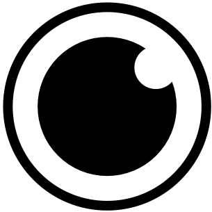
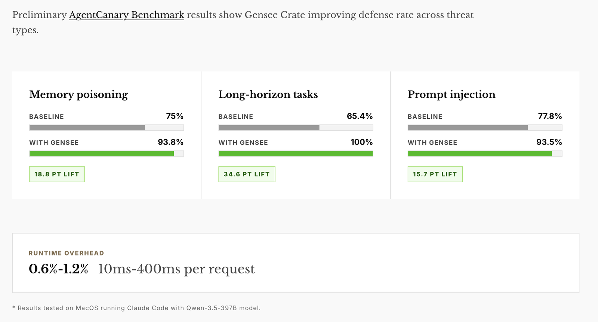
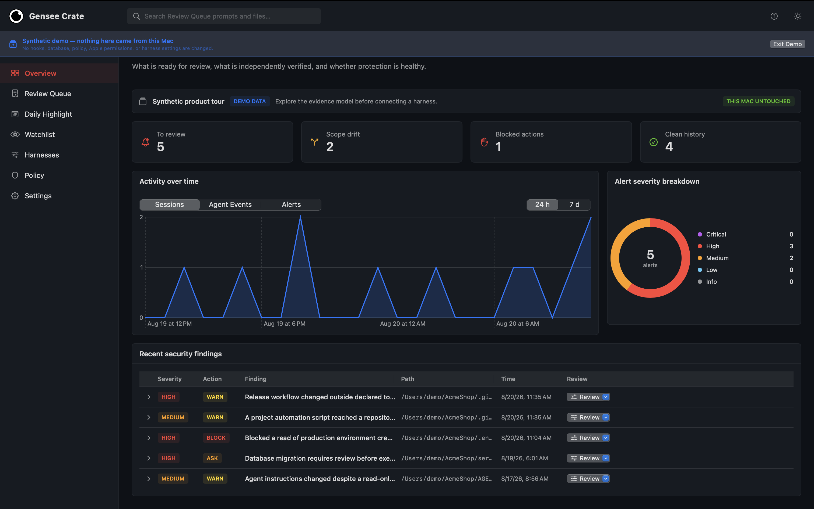
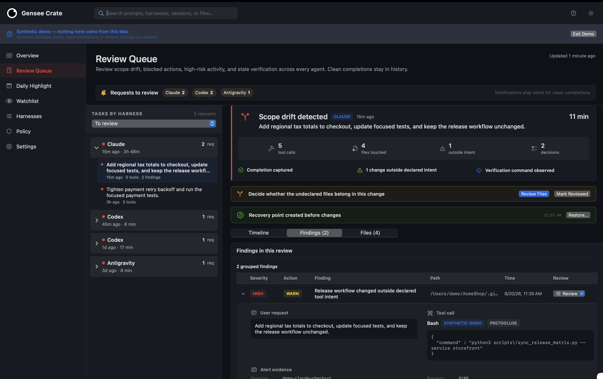
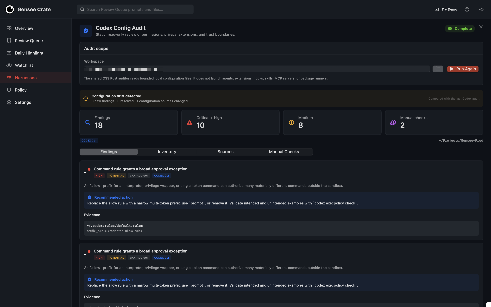

<h1 align="center">
  
  Gensee Crate
</h1>

<p align="center">
  <strong>Keep agent work moving. Keep authority and effects under control.</strong>
</p>

<p align="center">
  Gensee Crate is an open-source control layer for AI coding agents. On a
  developer laptop, it reviews completed work, surfaces scope drift, creates
  recovery points, and audits the configuration that can influence an agent.
  On a self-hosted Linux environment, it adds disposable workspace forks,
  scoped capabilities, short-lived leases, host-side observation, and
  evidence-gated promotion. Both deployment paths use the same policy and
  evidence model: connect what the user asked for to the authority the agent
  received, the effects that occurred, and the changes that were allowed to
  persist.
</p>

<p align="center">
  <a href="LICENSE"></a>
  
  
  
</p>

<p align="center">
  <a href="https://www.gensee.ai/">gensee.ai</a>
  ·
  <a href="https://crate-docs.gensee.ai/">Docs</a>
  ·
  <a href="https://www.gensee.ai/discord">Join Discord</a>
  ·
  <strong><a href="https://github.com/GenseeAI/gensee-crate/releases/latest/download/Gensee-Crate.dmg">⬇️ Download the macOS app</a></strong>
</p>

<p align="center">
  Need customization or enterprise solutions?
  <a href="https://www.gensee.ai/contact.html">Contact GenseeAI</a>.
</p>

---

## Why Gensee Crate

- **Review decisions, not agent transcripts.** Personal directs your attention
  to scope drift, failed verification, blocked work, and other exceptions while
  keeping clean completions quiet.
- **Explore risky work without risking the source environment.** Team can fork
  a complete Linux workspace, run one or several approaches, and let a human
  merge, promote, or discard the result.
- **Make agent authority explainable.** Gensee connects intent, policy,
  capability decisions, process and file effects, evidence, cleanup, and the
  final persistence decision.

## Benchmark results

Preliminary AgentCanary results show Gensee Crate improving defense rate across
memory-poisoning, long-horizon, and prompt-injection threat types with low
runtime overhead.



## Gensee Crate Personal

<details>
<summary><strong>Local protection and review for your laptop</strong></summary>

### What it is

Gensee Crate Personal is a local-first macOS app and CLI for individual
developers using Codex, Claude Code, Cursor, GitHub Copilot, Antigravity, or
Omnigent. Your policy, agent events, reviews, and feedback remain in your local
Gensee store.

### What it adds

- A **Review Queue** that groups work by request and shows what needs attention.
- **Scope-drift detection** that compares declared tool intent with file
  mutations independently observed by macOS Endpoint Security.
- **Smart recovery points** before risky Git-workspace changes, with restore
  actions in the review.
- **Configuration audit** for instructions, skills, MCP servers, hooks,
  permissions, plugins, command rules, and other inputs that can change agent
  behavior.
- Local policy enforcement, actionable findings, verification freshness,
  activity highlights, notifications, and a menu-bar summary.

### Download the macOS app

**[⬇️ Download Gensee Crate Personal for macOS](https://github.com/GenseeAI/gensee-crate/releases/latest/download/Gensee-Crate.dmg)**

The signed app bundles the Gensee backend and SQLite support. It does not
require Homebrew, Rust, Xcode, `jq`, or a separate SQLite installation. See the
**[Gensee Crate Personal for macOS guide](macos/GenseeCrate/README.md)** for
installation, first-run setup, Apple approvals, harness protection, and local
troubleshooting.

### See it in use

<p align="center">
  
</p>
<p align="center"><em>Start with the work that needs you; clean completions remain available without creating noise.</em></p>

<p align="center">
  
</p>
<p align="center"><em>Review scope drift, evidence, affected files, verification freshness, and the recovery point in one request-scoped view.</em></p>

<p align="center">
  
</p>
<p align="center"><em>Audit static agent configuration without running it.</em></p>

### Use the CLI instead

Install the CLI and initialize the local store:

```bash
curl -fsSL https://raw.githubusercontent.com/GenseeAI/gensee-crate/main/scripts/install_oss.sh | bash
export GENSEE_HOME="${GENSEE_HOME:-$HOME/.gensee}"
```

Configure the harnesses you use:

```bash
gensee setup codex --gensee-home "$GENSEE_HOME"
gensee setup claude-code --gensee-home "$GENSEE_HOME"
```

Run an agent through Gensee when you want an explicit managed session:

```bash
gensee run -- codex
# or
gensee run -- claude
```

Inspect the results:

```bash
gensee audit codex
gensee run list --json
gensee timeline --latest
gensee status --json
```

The desktop app is the recommended macOS experience. The CLI remains useful
for automation, terminals, and Linux workstations. See [Claude Code hook
setup](docs/claude-code-hooks.md), [policy](docs/policy.md), [configuration
audit](docs/config-audit.md), and [run and sandbox modes](docs/run-and-sandbox.md)
for the complete command-line workflow.

</details>

## Gensee Crate Team

<details>
<summary><strong>Self-hosted agent infrastructure for remote Linux environments</strong></summary>

### What it is

Gensee Crate Team is the self-hosted path for small teams and businesses that
want to operate their own Gensee deployment and agent environments. Agents run
on a prepared remote Linux host rather than developer laptops. The team keeps
control of its source, policy, credentials, runtime, evidence, and lifecycle
decisions.

### What it adds

The operating principle is simple:

```text
intent
  → capability decision
  → lease, mediator, cell, or workspace fork
  → observed effects
  → merge, promote, or discard
  → revocation and cleanup
```

- **Transactional workspace forks.** `tclone` creates low-latency,
  whole-workspace forks for one or several approaches. Each fork can be
  inspected and tested before a human merges it, promotes it, or discards it.
- **Bounded authority.** Request-scoped capability decisions and short-lived
  leases limit filesystem, network, repository, workload-identity, database,
  and external-action authority.
- **Credentials stay on the host.** The capability broker owns credential
  material and gives cells opaque lease IDs, scoped handles, or trusted gateway
  endpoints instead of broad secrets.
- **Independent evidence.** Host observation, process lineage, effect
  manifests, replay plans, promotion receipts, and cleanup journals make it
  possible to explain what occurred and whether it stayed within the granted
  authority.
- **Promotion is a policy decision.** Manifest violations, incomplete evidence,
  failed cleanup, expired authority, or missing commit tokens can prevent work
  from becoming durable.

The strongest end-to-end enforcement today is in tclone capability cells and
network mediation. Additional capability backends are under active development;
see the [roadmap](docs/roadmap.md) for the current boundary.

### Install on a Linux host

Install Gensee Crate:

```bash
curl -fsSL https://raw.githubusercontent.com/GenseeAI/gensee-crate/main/scripts/install_oss.sh | bash
export GENSEE_HOME="${GENSEE_HOME:-$HOME/.gensee}"
```

Then prepare the remote host with the tclone-enabled
[`os4agent`](https://github.com/GenseeAI/os4agent) runtime, rootful Podman with
`btrfs`, and a tclone image. Follow the [tclone host setup](docs/tclone.md)
rather than copying host-storage settings between machines.

After host preparation, define the wrapper used by the tclone workflow:

```bash
export GENSEE_TCLONE_PODMAN="$HOME/os4agent/podman-tfork.sh"
export GENSEE_TCLONE_IMAGE="${GENSEE_TCLONE_IMAGE:-localhost/gensee-tclone-webtop:tmux}"
export GENSEE_TMP_ROOT="${GENSEE_TMP_ROOT:-/tmp}"
export TMPDIR="$GENSEE_TMP_ROOT"

alias gensee-tclone='sudo env \
  PATH="$PATH" HOME="$HOME" GENSEE_HOME="$GENSEE_HOME" \
  GENSEE_TCLONE_PODMAN="$GENSEE_TCLONE_PODMAN" \
  GENSEE_TCLONE_IMAGE="$GENSEE_TCLONE_IMAGE" \
  GENSEE_TMP_ROOT="$GENSEE_TMP_ROOT" TMPDIR="$TMPDIR" \
  gensee'
```

### Run and fork agent work

Start the source agent in the prepared runtime:

```bash
gensee-tclone run --runtime tclone -- codex
```

Create one fork or compare multiple approaches:

```bash
gensee-tclone run list --json

gensee-tclone run fork <source-run-id> \
  --copies 2 \
  --name try-upgrade \
  --approach 'minimal compatible upgrade' \
  --approach 'aggressive latest-version upgrade' \
  --attach tmux:right \
  --json
```

### Examine results and decide what persists

```bash
gensee-tclone run summary <fork-id> --json
gensee-tclone run diff <fork-id> --json
gensee-tclone run compare <parallel-fork-id> --json

# After an explicit human decision:
gensee-tclone run choose <parallel-fork-id> --merge
# or: --promote
# or: --discard-all
```

Use `gensee timeline`, `gensee status --json`, and the local [Gensee
dashboard](docs/dashboard.md) to examine policy decisions, runtime evidence,
effects, cleanup, and promotion outcomes. The [tclone guide](docs/tclone.md) and
[capability broker guide](docs/capability-broker.md) describe the complete host,
lease, mediation, and lifecycle model.

</details>

## Roadmap

- **Personal:** richer verification results, more harness integrations, quieter
  request-level decisions, and broader independent network evidence.
- **Team:** more capability adapters and trusted mediators, a generalized
  dispatcher across effect domains, stronger remote evidence export, and
  counterfactual replay before policy changes.
- **Both:** keep deterministic policy and evidence portable while making the
  default workflow require less supervision—not more.

Follow the detailed [project roadmap](docs/roadmap.md) and [open
issues](https://github.com/GenseeAI/gensee-crate/issues) for current work.

## Documentation

- [Gensee Crate Personal for macOS](macos/GenseeCrate/README.md)
- [Architecture](docs/architecture.md)
- [Policy](docs/policy.md)
- [Claude Code hooks](docs/claude-code-hooks.md)
- [Configuration audit](docs/config-audit.md)
- [Run and sandbox modes](docs/run-and-sandbox.md)
- [Linux controls](docs/linux.md)
- [tclone transactional runtime](docs/tclone.md)
- [Capability broker and leases](docs/capability-broker.md)
- [Dashboard](docs/dashboard.md)
- [Roadmap](docs/roadmap.md)

Gensee Crate is available under the [Apache 2.0 license](LICENSE).
